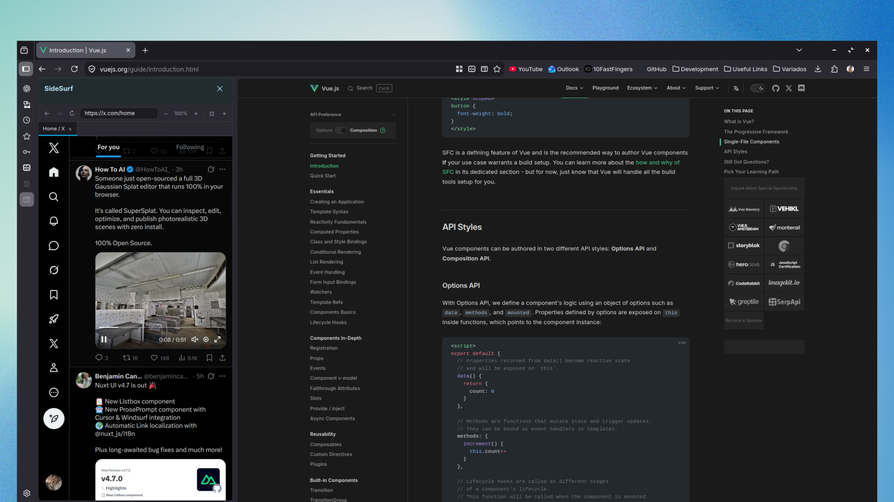
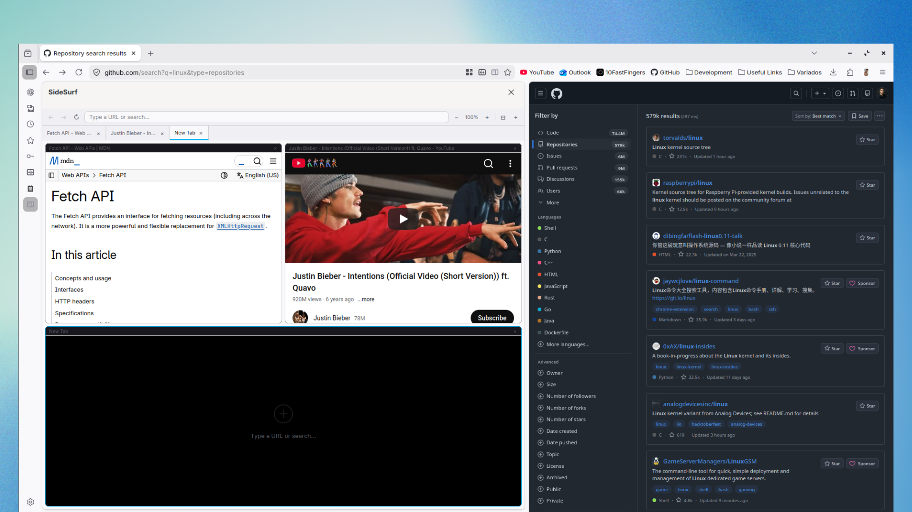

# SideSurf 🔲

**SideSurf** is an advanced Firefox extension that adds a fully functional mini-browser to your sidebar.

Unlike Firefox’s native split view, the sidebar remains visible across all tabs, enabling true multitasking without losing context. Perfect for documentation, dashboards, or secondary browsing.

## 📸 Preview

  
  

  <em>Tabs Mode (left) and Tiling Mode (right)</em>

---

## 🔥 Features

- **Full Navigation:** URL bar with autocomplete, internal history, and reload.
- **Multi-Tab Support:** Up to 6 independent tabs inside the sidebar.
- **Flexible Layouts:**  
  `⊡ Tabs` (single view) or `⊟ Tiling` (smart grid layout).
- **Enhanced Compatibility:** Better support for complex websites inside embedded views.
- **Link Control:** Keeps navigation contained within the extension.
- **Automatic Persistence:** Tabs, zoom levels, and history are saved.
- **i18n & Theming:** Multi-language support with automatic dark/light mode.

---

## 🚀 Shortcuts

| Shortcut            | Action                |
| ------------------- | --------------------- |
| `Ctrl+Shift+S`      | Toggle SideSurf       |
| `Ctrl+L`            | Focus URL bar         |
| `Ctrl+T` / `Ctrl+W` | New / close tab       |
| `Alt+←` / `Alt+→`   | Navigate back/forward |

---

## 🤝 Contributing

SideSurf is 100% open source — contributions are welcome!

1. Fork the project
2. Create a feature branch
3. Commit your changes
4. Push and open a Pull Request

Feel free to open issues for bugs or feature requests.

---

## ☕ Support

If SideSurf improves your workflow, consider supporting development:  
👉 https://ko-fi.com/caiquegaspar
